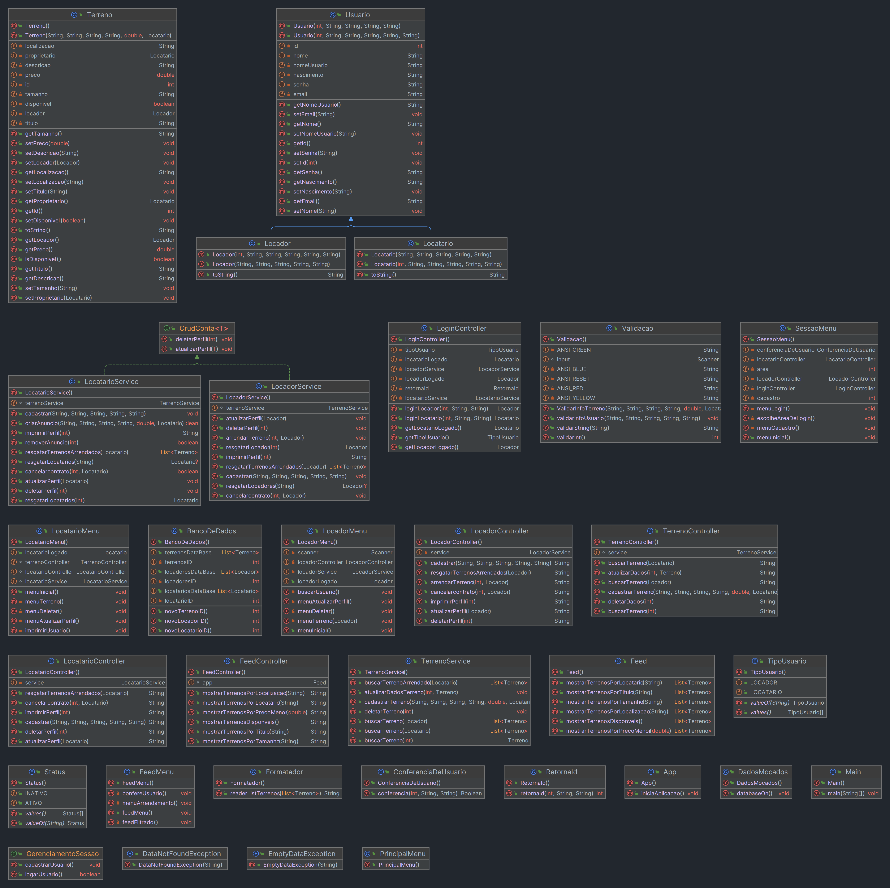

  
  

# TerrAtiva ♻️🌱

A plataforma proposta é uma solução online que facilita o arrendamento de terras, conectando proprietários a interessados em utilizá-las. Focada na sustentabilidade, a plataforma promove a agricultura responsável, reduz custos para agricultores e gera renda adicional para proprietários. Além de evitar a ociosidade de terras, a iniciativa fortalece a colaboração entre comunidades agrícolas, incentivando práticas sustentáveis e combatendo a desertificação.

## Acessando os Arquivos 📚

Clique no botão abaixo para acessar o Relatório em formato de PDF através do nevagador. Na página há também um botão no canto superior direito, logo acima do relatório, para realizar download do arquivo para sua máquina.

## Referências 🗞️📰

### [Os Objetivos de Desenvolvimento Sustentável no Brasil](https://brasil.un.org/pt-br)

### [Objetivo de Desenvolvimento Sustentável - 15 - Vida Terrestre](https://www.ipea.gov.br/ods/ods15.html)

### [Benefícios Fiscais para Desenvolvimento Sustentável](https://www.conjur.com.br/2023-jun-12/elaise-sestrem-beneficios-fiscais-desenvolvimento-sustentavel/)

### [Política Tributária e Incentivo a Tecnologias Sustentáveis](https://www.ipea.gov.br/cts/pt/central-de-conteudo/artigos/artigos/309-politica-tributaria-e-incentivo-a-tecnologias-sustentaveis-o-brasil-na-contramao)

### [Proposta de Emissão de Debêntures Verdes (Câmara dos Deputados)](https://www.camara.leg.br/noticias/852063-proposta-permite-a-emissao-de-debentures-incentivadas-para-projetos-sus%20tentaveis/)

### [53 Cidades do Brasil com mais Residências Vazias do que Ocupadas](https://www.nsctotal.com.br/noticias/conheca-as-53-cidades-do-brasil-com-mais-residencias-vazias-do-que-ocupadas#:~:text=Arroio%20do%20Sal%20%28RS%29%20%E2%80%93%2076%2C2%25%20Xangri-l%C3%A1%20%28RS%29,%E2%80%93%2068%2C3%25%20Pontal%20do%20Paran%C3%A1%20%28PR%29%20%E2%80%93%2068%2C1%25)

### [IBGE: Áreas Urbanizadas](https://www.ibge.gov.br/geociencias/cartas-e-mapas/redes-geograficas/15789-areas-urbanizadas.html)

## Pré-Requisitos ⚙️

- [IntelliJ Idea](https://www.jetbrains.com/idea/)
- [JDK17](https://www.oracle.com/java/technologies/downloads/)
- [OJDBC](https://www.oracle.com/database/technologies/appdev/jdbc-downloads.html)

## Diagrama UML

## Integrantes do Projeto 👨‍💻

<!-- ALL-CONTRIBUTORS-LIST:START - Do not remove or modify this section -->
<!-- prettier-ignore-start -->
<!-- markdownlint-disable -->
<table>
  <tbody>
    <tr>
      <td align="center" valign="top" width="14.28%"><a href="https://www.github.com/DavidKirsch-DBC"> <b>David Kirsch</b></a> </td>
      <td align="center" valign="top" width="14.28%"><a href="https://www.github.com/Leonardo-Rauber"> <b>Leonardo Rauber</b></a> </td>
      <td align="center" valign="top" width="14.28%"><a href="https://www.github.com/lucasbernardodev"> <b>Lucas Lima</b></a> </td>
    </tr>
        <tr>
      <td align="center" valign="top" width="14.28%"><a href="https://www.github.com/ItaloLacerda"> <b>Italo Lacerda</b></a> </td>
          <td align="center" valign="top" width="14.28%"><a href="https://github.com/wesleysousaa"> <b>Wesley Souza</b></a></td>
      <td align="center" valign="top" width="14.28%"><a href="https://www.github.com/PedroBersch"> <b>Pedro Leotte Bersch
</b></a> </td>
    </tr>
        <tr>
      <td align="center" valign="top" width="14.28%"><a href="https://github.com/AssucenaSaldanhaa"> <b>Assucena Araujo</b></a> </td>
      <td align="center" valign="top" width="14.28%"><a href="https://www.github.com/rogervargass"> <b>Roger Vargas
</b></a> </td>
      <td align="center" valign="top" width="14.28%"><a href="https://github.com/RenanStMeira"> <b>Renan Meira</b></a> </td>
    </tr>
  </tbody>
</table>

## ex-Integrantes do Projeto 👨‍💻

Não chegariamos até aqui sem vocês <3

<table>
<tbody>
    </tr>
        <tr>
            <td align="center" valign="top" width="14.28%"><a href="https://www.github.com/pedrohpdo"> <b>Pedro Henrique Pereira</b></a> </td>
      <td align="center" valign="top" width="14.28%"><a href="https://www.github.com/Jessica-Garcia"> <b>Jessica Gargia</b></a> </td>
      <td align="center" valign="top" width="14.28%"><a href="https://www.github.com/Shaienne23"> <b>Shaianne Oliveira</b></a> </td>
    </tr>
  </tbody>
  </table>
